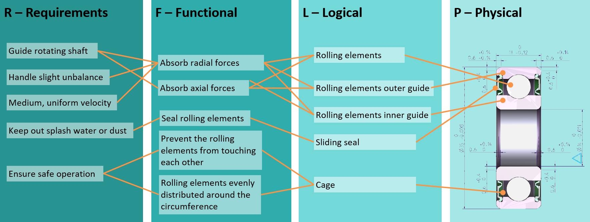
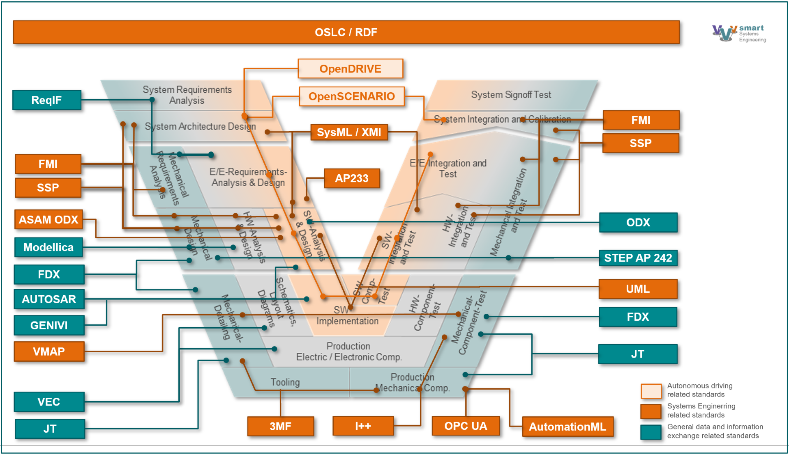
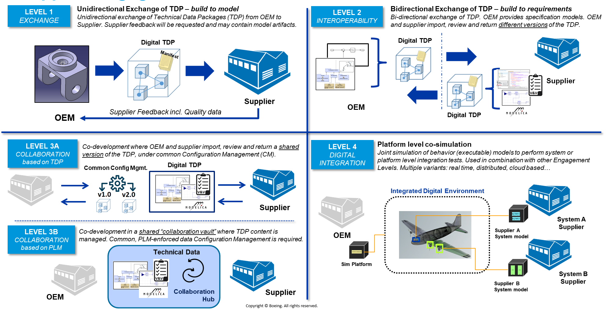
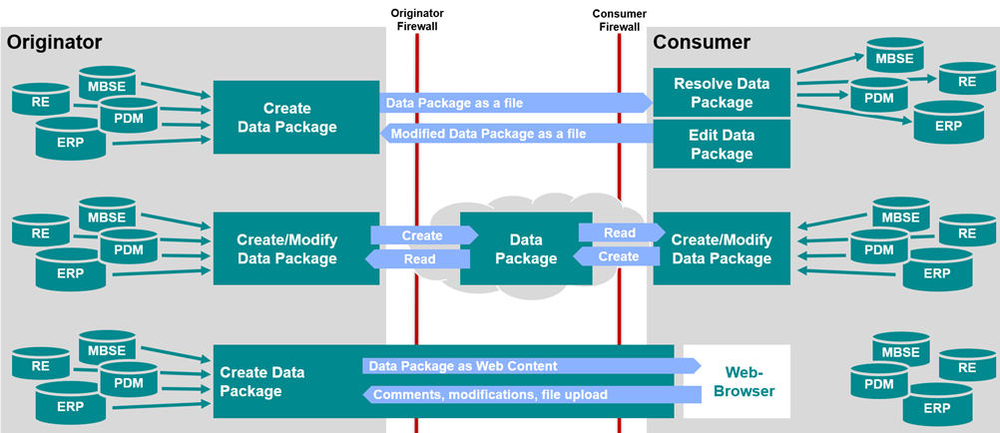

# Problem Statement

Mechatronic or software-driven products or systems are typically composed of 
large numbers of immaterial (conceptual) and material artifacts which are 
created and used in one or several lifecycle phases. The artifacts are created
using specific authoring systems, and need to be used across IT systems, 
disciplines and organizations. Hence, they are inputs and outputs of activities by 
different parties in the whole product lifecycle, collectively needed for
collaboration on the product.

The activities with input and output artifacts which are related to mechatronic 
and lately so-called cyber-physical systems are covered by the standard 
ISO/IEC-15288. As it establishes a useful structure and widely accepted terms, 
it has been adopted for the CASCaDE initiative.

_Fig.1: Example illustrating linked cross-domain product information. Source: Schaeffler AG._

The example in Fig. 1 illustrates artifacts related to a ball bearing in four 
abstraction levels from requirement to physical system (following the RFLP
design scheme by Dassault Systèmes Catia and others). The artifacts are 
interrelated, so that origin and consequences of a change can be traced. As 
pointed out above, the artifacts are produced in different development phases 
and by different teams using different tools, from elicitation of user needs to 
physical design for production, assembly, operation, repair and disposal. There 
is a need to put the artifacts of all participants and phases with their relations in a 
common context.
By nature, product information is conceptually interlinked in many ways: An 
information may depend on another or certain information is used in different 
point in time. Most generally, there are at least three dimensions of relations:

- Abstraction: During development, according to the widely accepted 
RFLP method, a product is described by Requirement (R), Function (F), 
Logical Architecture (L) and Physical Architecture (P) as discussed 
above.
- Decomposition: Usually, a product has multiple components organized 
in a Bill-of-Material (BoM).
- Lifecycle: In different phases of a product’s life from conception to 
disposal, different information is of importance.

Generally speaking, the entities have attributes, such as title, description, etc.
and are linked by causal, temporal or any other dependencies. A combination of 
a pair of entities with a relation is often called a statement composed of subject, 
predicate and object, or ‘Triple’. As such it is best represented by a graph of 
nodes and edges, commonly known as ‘Knowledge Graph’ or semantic net. By 
now, there are powerful technical solutions for Knowledge Graphs which can be 
applied with benefit.

_Fig.2: The V-Model of product development with some of the data formats used. Source: prostep ivip SmartSE Project Group Recommendation PSI 11 SmartSE V3._
 
As product information is created in a variety of authoring systems and 
primarily stored in proprietary formats or databases, an overarching knowledge 
graph does not exist today. However, there is a variety of domain-specific data 
formats established in the industry that help bridge the gaps between different 
systems. Fig. 2 shows the product development process in more detail using the 
widely adopted V-Model (VDI-2206). Some of the data formats used in certain 
development tasks are depicted with colored boxes. Those data formats are 
targeted to best support their respective purpose and are backed by specialized 
tools with their own innovation cycle. It happens by nature that the same artifact 
appears in different data sets, making it difficult to propagate changes or even 
detect dependencies. Therefore, a translation of individual data sets and 
integration to an overarching Knowledge Graph is required.

Finally, there are different ways of interaction between organizations or, in 
terms of BPMN, collaborating participants. Boeing for example defines four 
levels of collaboration in their Supplier Enablement Framework (SEF) as shown 
in Fig. 3.

_Fig.3: Boeing defines four levels of collaboration using a “Technical Data Package” (TDP). Source: Boeing Inc._

The four levels of collaboration are characterized as follows:

|  | Level 1 | Level 2 | Level 3A | Level 3B | Level 4 |
| --- | --- | --- | --- | --- | --- |
| Title | Exchange | Interoperability | Collaboration based on TDP | Collaboration based on PLM | Digital Integration |
| Direction | to supplier | to and from supplier | to and from supplier | to and from supplier | to and from supplier |
| Configuration Management | no | no | yes | yes | yes |
| Data management | file exchange | file exchange | file exchange | PLM collaboration or independent hub | fully integrated |

Similar to the BOEING four levels of collaboration, prostep ivip defines 3 modes of collaboration as depicted in Fig. 4:

_Fig.4: Collaboration modes according to prostep ivip. Source: Prostep iViP e.V._

CASCaDE shall address all those levels and modes. The information model 
must hence support serialization in a container for ‘offline’ or ‘asynchronous’ 
working as well as transactions on entities and relations for ‘online’ or 
‘synchronous’ working. Of course, the visibility and use of entities and relations 
is controlled by permissions per user role: Not everything is exposed to 
everyone.

Furthermore, work in parallel by different participants requires management of 
revisions at artifact level with branching and merging. Maintaining ‘working’ 
combinations of artifact revisions is commonly called configuration 
management. These operations are well understood by software development
and deployment (often called ‘Application Lifecycle Management (ALM), but 
also by Product Lifecycle Management (PLM).

Please note that the name CDP has been chosen to show the succession of 
Technical Data Package (TDP) and Digital Data Package (DDP). While both 
TDP and DDP have contributed important capabilities in data exchange and 
collaboration in general, a solid foundation on existing OMG standards is 
missing. By applying formal methods to bridge technologies, interoperability 
will be greatly enhanced. The authors are well aware that the notion of 
‘package’ in CDP may not adequately describe the more advanced collaboration 
modes as mentioned before.
