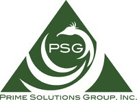

# Project

The project organization and the tasks to complete the standard plus verification & validation 
using a commonly developed reference implementation are currently in discussion. 
So the following setup is preliminary.

## Focus Areas

Successful Standardization needs more than a Standard: A Reference Implementation plus Verification & Validation. 
Certification is needed later on once the standard is established and software products are developed and released.

## Organization

The normative specification will be prepared by the Submission Team. 
To assure usefulness and quality of the standard, it is important that verification and validation (V&V) is done in parallel.
A publicly available reference implementation is best suited for V&V. 

It's about collaboration, so let's collaborate.

Proposal for agile project management:

<table>
<thead>
<tr>
<th>Subproject</th><th>Description</th><th class="width-20">Responsibility</th>
</tr>
</thead>
<tbody>
<tr>
<td><a href="https://github.com/orgs/GfSE/projects/10" target="_blank">CASCaDE Metamodel</a></td><td>Development of schema and constraints ("syntax") as part of the standard</td><td class="blue">Submission Team (WP1)</td>
</tr>
<tr>
<td><a href="https://github.com/orgs/GfSE/projects/6" target="_blank">CASCaDE Ontology</a></td><td>Development of terms/concepts ("semantics") as part of the standard</td><td class="blue">Submission Team (WP2)</td>
</tr>
<tr>
<td>CASCaDE Operations</td><td>Development of operations as part of the standard</td><td class="blue">Submission Team (WP3)</td>
</tr>
<tr>
<td>CASCaDE Transformations</td><td>Development of transformations as part of the standard</td><td class="blue">Submission Team (WP4)</td>
</tr>
<tr>
<td><a href="https://github.com/orgs/GfSE/projects/8" target="_blank">CASCaDE Requirements Verification</a></td><td>Verificiation of the requirements as listed in the RFP</td><td class="blue">Submission Team (WP5)</td>
</tr>
<tr>
<td><a href="https://github.com/orgs/GfSE/projects/12" target="_blank">CASCaDE Specification</a></td><td>Development of operations as part of the standard</td><td class="blue">Submission Team (WP6)</td>
</tr>
<tr>
<td><a href="https://github.com/orgs/GfSE/projects/5" target="_blank">CASCaDE Reference Implementation</a></td><td>Reference implementation</td><td class="rose">Development Team</td>
</tr>
<tr>
<td><a href="https://github.com/orgs/GfSE/projects/8" target="_blank">CASCaDE Verification and Validation</a></td><td>Verificiation and validation of the standard using the reference implementation</td><td class="yellow">V&V Team</td>
</tr>
</tbody>
</table>

## Milestones

_Third Draft (2025-01-21)_

The milestones are matched with the schedule of the submission team to effectively verify and validate the upcoming standard in parallel to the submission.
This reflects the current planning which shall be reviewed and reworked with the contributing project partners.

### Milestone 2025-03

<table>
<thead>
<tr>
<th>Description</th><th class="width-20">Responsibility</th>
</tr>
</thead>
<tbody>
<tr>
<td><ul><li>Metamodel ("PIM") as well as schema with constraints ("PSM") for Knowledge Graph defined</li></ul></td><td class="blue">Submission Team</td>
</tr>
</tbody>
</table>

### Milestone 2025-06

<table>
<thead>
<tr>
<th>Description</th><th class="width-20">Responsibility</th>
</tr>
</thead>
<tbody>
<tr>
<td><ul><li>Schema for Ontology defined</li><li>First draft ontology defined (reusing existing results)</li></ul></td><td class="blue">Submission Team</td>
</tr>
<tr>
<td><ul><li>Schema for Knowledge Graph implemented</li><li>Simple Knowledge Graph created</li><li>Simple Frontend for Knowledge Graph (including preparation of framework)</li></ul></td><td class="rose">Development Team</td>
</tr>
</tbody>
</table>

### Milestone 2025-09

<table>
<thead>
<tr>
<th>Description</th><th class="width-20">Responsibility</th>
</tr>
</thead>
<tbody>
<tr>
<td><ul><li>Knowledge Graph created</li><li>Improved Frontend for Knowledge Graph</li><li>Two transformations to Knowledge Graph implemented</li></ul></td><td class="rose">Development Team</td>
</tr>
<tr>
<td><ul><li>Requirements V&V</li></ul></td><td class="yellow">V&V Team</td>
</tr>
<tr>
<td><ul><li>Open API defined</li><li><strong>Initial Standard document submitted to OMG</strong></li></ul></td><td class="blue">Submission Team</td>
</tr>
</tbody>
</table>

### Milestone 2025-12

<table>
<thead>
<tr>
<th>Description</th><th class="width-20">Responsibility</th>
</tr>
</thead>
<tbody>
<tr>
<td><ul><li>Open API implemented (MVP)</li><li>Improved Frontend for Knowledge Graph</li><li>Two Exports from Knowledge Graph (e.g. native and HTML)</li></ul></td><td class="rose">Development Team</td>
</tr>
<tr>
<td><ul><li>Requirements V&V</li><li>Two transformations validated (including preparation of test-data)</li></ul></td><td class="yellow">V&V Team</td>
</tr>
<tr>
<td><ul><li>Second Draft Ontology defined</li><li><strong>Revised Standard document submitted to OMG</strong></li></ul></td><td class="blue">Submission Team</td>
</tr>
</tbody>
</table>

### Milestone 2026-03

<table>
<thead>
<tr>
<th>Description</th><th class="width-20">Responsibility</th>
</tr>
</thead>
<tbody>
<tr>
<td><ul><li>One more transformation and model integration implemented (MVP)</li></ul></td><td class="rose">Development Team</td>
</tr>
<tr>
<td><ul><li>Draft ontology validated</li></ul></td><td class="yellow">V&V Team</td>
</tr>
<tr>
<td><ul><li>Final ontology defined</li><li><strong>Final Standard document submitted to OMG</strong></li></ul></td><td class="blue">Submission Team</td>
</tr>
</tbody>
</table>

### Milestone 2026-06

<table>
<thead>
<tr>
<th>Description</th><th class="width-20">Responsibility</th>
</tr>
</thead>
<tbody>
<tr>
<td><ul><li></li><li>One more transformation and model integration implemented</li></ul></td><td class="rose">Development Team</td>
</tr>
<tr>
<td><ul><li>Final ontology validated</li></ul></td><td class="yellow">V&V Team</td>
</tr>
<tr>
<td><ul><li>Findings of V&V and FTF addressed</li></ul></td><td class="blue">Submission Team</td>
</tr>
</tbody>
</table>

### Milestone 2026-09

<table>
<thead>
<tr>
<th>Description</th><th class="width-20">Responsibility</th>
</tr>
</thead>
<tbody>
<tr>
<td><ul><li>Open API complemented</li></ul></td><td class="rose">Development Team</td>
</tr>
<tr>
<td><ul><li>Three transformations and model integration validated</li></ul></td><td class="yellow">V&V Team</td>
</tr>
<tr>
<td><ul><li>Findings of V&V and FTF addressed</li></ul></td><td class="blue">Submission Team</td>
</tr>
</tbody>
</table>

### Milestone 2026-12

<table>
<thead>
<tr>
<th>Description</th><th class="width-20">Responsibility</th>
</tr>
</thead>
<tbody>
<tr>
<td><ul><li>Reference implementation refactored and released</li></ul></td><td class="rose">Development Team</td>
</tr>
<tr>
<td><ul><li>Standard and reference implementation validated</li></ul></td><td class="yellow">V&V Team</td>
</tr>
<tr>
<td><ul><li>Findings of V&V and FTF addressed</li><li><strong>Standard adopted by OMG</strong></li></ul></td><td class="blue">Submission Team</td>
</tr>
</tbody>
</table>

## Contributing Partners

The teams responsible for reference implementation resp. verification and validation are looking for funding. 
The work will begin, if a minimum capacity of 4 full-time-equivalent (FTE) team members are committed.

Organizations contributing to the effort will form a Product Owner Committee (POC) defining the priority of backlog items 
and reviewing the results per iteration ("sprint").

<table>
<thead>
<tr>
<th>Organization</th><th>POC Member</th><th>Roles</th><th>2025</th><th>2026</th>
</tr>
</thead>
<tbody>
<tr>
<td><a href="https://enso-managers.de" target="_blank">enso managers GmbH, Berlin</a></td><td>O.v.Dungern</td><td>Software Architect, Product Owner</td><td style="text-align: center;">0.4 FTE</td><td style="text-align: center;">0.4 FTE</td>
</tr>
<tr>
<td><a href="https://psg-inc.net/" target="_blank">Prime Solutions Group, Inc., Goodyear AZ</a></td><td>J.M.Alletto</td><td>Software Architect, Product Owner, Software Developer</td><td style="text-align: center;">tbd</td><td style="text-align: center;">tbd</td>
</tr>
<tr>
<td>SE-TREC GmbH</td><td>R.Kaffenberger</td><td>Sponsor</td><td style="text-align: center;">0.4 FTE</td><td style="text-align: center;">tbd</td>
</tr>
<tr>
<td></td><td></td><td></td><td style="text-align: center;"></td><td style="text-align: center;"></td>
</tr>
</tbody>
</table>

## Why Open Source ?

### Join Forces for Quality and Speed

Publicly available reference implementation and test cases support standard quality and speed of adoption.
Examples of successful collaborations are:
- The German Car Industry has built an ecosystem with a shared supply chain from the beginning. 
The sparking plug has been produced by Robert Bosch; the OEMs did not build it themselves.
- INSTA Elektro GmbH has been founded by competing GIRA, Jung and Berker to share the cost of electronics development (dimmers, timers etc.). 
- All web-browsers (Firefox, Edge, Chrome, Safari, Opera and many others) use one of the open-source engines Gecko, WebKit or Blink. 
Opera and even Microsoft have abandoned their own browser engines in favor of an open-source product.

Why should software-vendors develop the standard core-features of CASCaDE independently by themselves? And why debug towards interoperability later on? 

### Benefits of an Open-Source "Community Edition"

<table>
<thead>
<tr>
<th>for Software Users</th>
<th>for Software Vendors</th>
</tr>
</thead>
<tbody>
<tr>
<td>
<ul>
<li>Direct influence on features and priorities</li>
<li>First „Minimal Viable Product“ within a year</li>
<li>Early evaluation and pilot projects</li>
<li>Smaller organizations (suppliers) can participate in collaboration and data exchange with minor cost</li>
<li>Reference for compatibility and interoperability</li>
<li>Independent certification of software products</li>
</ul>
</td>
<td>
<ul>
<li>„Basic Features“ (Kano) don‘t allow differentiation and are jointly developed; lots of cost saved</li>
<li>Discussion and support by voluntary contributors</li>
<li>Market-proven base for „Enterprise Editions“ with professional features</li>
<li>Solution gets known without marketing effort</li>
<li>Proven marketing approach for innovative software products</li>
<li>Many successful examples not only in the US, but also in Europe</li>
</ul>
</td>
</tr>
</tbody>
</table>
